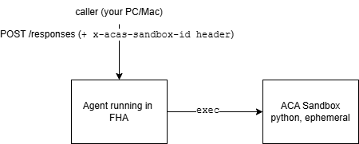

# CodeAct Pattern with Foundry Hosted Agents and ACA Sandboxes

A standalone sample that deploys a [**Foundry Hosted Agent (FHA)**](https://learn.microsoft.com/en-us/azure/foundry/agents/concepts/hosted-agents) which
executes Python code and shell commands inside an [**Azure Container Apps
Sandbox (ACAS)**](https://sandboxes.azure.com) — the "CodeAct" pattern.

The agent is built using the Microsoft Agent Framework (MAF), and is deployed to FHA. It uses the [`acas-toolkit`](https://github.com/AshuJoshi/acas-toolkit) to route `execute_code` and `run_shell` tool calls into a sandbox you own.





### More Info:

[CodeAct](docs/codeactintro.md)  
[ACA Sandboxes](docs/ACASandboxesIntro.md)


---

## Prerequisites

- **Azure subscription** with quota for:
  - Cognitive Services (Foundry account) in `eastus2` or `westus2`
  - One `gpt-5.4` model deployment (default; configurable — see Bicep params, you can always use a different model)
  - One ACA sandbox group (preview) in your chosen region

- **CLI tooling on your laptop:**
  - [Azure CLI](https://learn.microsoft.com/cli/azure/install-azure-cli) — `az login` once
  - [Azure Developer CLI](https://learn.microsoft.com/azure/developer/azure-developer-cli/install-azd) (`azd`) — for `azd up`
  - [uv](https://docs.astral.sh/uv/getting-started/installation/) — for host-side Python
- Python **3.12** (uv will fetch it if missing — see `.python-version`)

## Deploy from scratch

```bash
git clone <this-repo>
cd fha-acas-codeact

# 1. Authenticate
az login
azd auth login

# 2. Provision infra + deploy agent (single command)
azd up
```

`azd up` will:

1. Prompt for an environment name (e.g. `dev`), location, and Foundry model choice
2. Provision a fresh resource group containing:
   - ACAS sandbox group
   - Foundry account + project + chosen model deployment
   - Container Registry (for the agent image)
   - User-assigned Managed Identity + role assignments
   - Log Analytics + Application Insights
3. Build the agent container in ACR via remote build (no local Docker needed)
4. Register a new agent version in your Foundry project

See [docs/deploy.md](docs/deploy.md) for the step-by-step breakdown and
troubleshooting.

## Invoke the deployed agent

After `azd up` completes, the post-deploy hook writes the agent endpoint
into `.azure/<env>/.env`. The orchestrator loads it automatically:

```bash
# Sync the host-side venv (uv reads pyproject.toml + uv.lock)
uv sync

# Run a prompt end-to-end (creates a sandbox, invokes the agent, deletes it)
uv run python scripts/orchestrate_codeact.py \
    "compute the first 20 fibonacci numbers"
```

> **No manual `source` step needed.** `scripts/orchestrate_codeact.py`
> auto-discovers the active azd environment (via `AZURE_ENV_NAME` or the
> `defaultEnvironment` in `.azure/config.json`) and loads its `.env`
> without overriding anything you've already exported. See
> [docs/deploy.md](docs/deploy.md#3-first-invocation) for details and how
> to source manually for the other `scripts/*.py` if you need to.

Expected output: the assistant reports running Python in the sandbox and
prints the list `[0, 1, 1, 2, 3, ..., 4181]`.

### More invocation modes

```bash
# Reuse an existing sandbox (skip create + delete)
uv run python scripts/orchestrate_codeact.py "show /etc/os-release" \
    --sandbox-id <existing-sandbox-id>

# Keep the sandbox around for the next call
uv run python scripts/orchestrate_codeact.py "install requests" \
    --keep-sandbox

# Force a fresh chat session (new per-conversation isolation)
uv run python scripts/orchestrate_codeact.py "import this" --new-session
```

---

## Comparison models (optional)

The default deploy stands up a single model (`gpt-5.4`). To A/B other models
against it — e.g. **Fireworks GLM-5.2** and **Fireworks Kimi-K2.7-Code**, both
tuned for coding — use the standalone helper. It is intentionally **not** part
of `azd up`, so the primary deploy stays lean and Microsoft-only.

> ⚠️ **The Fireworks models (GLM-5.2, Kimi-K2.7-Code) are Non-Microsoft
> (partner MaaS) models.** Using them shares data with Fireworks AI and sends
> it outside Microsoft systems, under different compliance/data-handling
> rules. They are also billable pay-as-you-go for as long as they are
> deployed. Review the model card and https://trust.fireworks.ai/ before
> sending sensitive code or data through them.

`scripts/deploy_comparison_model.py` keeps a small **registry** of known
comparison models (`COMPARISON_MODELS`). Deploy or tear down a whole set with
`--models`, or a single ad-hoc model with the individual flags.

```bash
# Deploy the whole comparison set (GLM-5.2 + Kimi-K2.7-Code) at capacity 10,
# matching gpt-5.4's throughput for a fair comparison.
uv run python scripts/deploy_comparison_model.py --models all --capacity 10

# Deploy just one registry model
uv run python scripts/deploy_comparison_model.py --models kimi-k2.7-code --capacity 10

# List deployments on the account
uv run python scripts/deploy_comparison_model.py --list

# Deploy a different Fireworks model under a custom deployment name (ad-hoc)
uv run python scripts/deploy_comparison_model.py \
    --deployment-name qwen3 --model-name FW-Qwen3.6-35B-A3B

# Tear down the whole set (does not touch gpt-5.4) — stops paygo billing
uv run python scripts/deploy_comparison_model.py --models all --delete
```

> **Finding the catalog params for a new model.** The registry entries were
> verified against the live account. To look up the exact catalog name,
> version, and available SKUs for a model before adding it:
>
> ```bash
> az cognitiveservices account list-models \
>     -n "$FOUNDRY_ACCOUNT_NAME" -g "$AZURE_RESOURCE_GROUP" \
>     --query "[?contains(name,'Kimi')].{name:name, format:format, version:version, skus:join(',', skus[].name)}" \
>     -o table
> ```

### Pointing the agent at the other model

The agent is model-agnostic: [`agent/agent.yaml`](agent/agent.yaml) reads
`${AZURE_AI_MODEL_DEPLOYMENT_NAME}`, which `azd` substitutes from the env at
deploy time — the model is **not** hard-coded in the YAML. To rerun the same
FHA against GLM-5.2, override that variable and redeploy the agent:

```bash
# Swap the agent to the GLM-5.2 deployment and redeploy (no re-provision)
azd env set AZURE_AI_MODEL_DEPLOYMENT_NAME glm-5.2
azd deploy

# ...run your prompts, then switch back to gpt-5.4
azd env set AZURE_AI_MODEL_DEPLOYMENT_NAME gpt-5.4
azd deploy
```

> Note: `AZURE_AI_MODEL_DEPLOYMENT_NAME` is also a Bicep **output**, so a
> subsequent `azd provision` resets it to the Bicep-deployed model
> (`gpt-5.4`). The `azd env set` override only sticks until the next
> provision — fine for an A/B run; for a permanent switch, change the model
> in [`infra/main.bicep`](infra/main.bicep) instead.

---

## Benchmark models locally

To compare models **without** the FHA deploy cycle, run the agent loop on your
laptop while code still executes in a real ACA Sandbox. This is a **local
harness** — it does not import or modify the deployed FHA agent, but is
*conceptually the same agent* (same instructions, the same `execute_code` /
`run_shell` tools, the same `FoundryChatClient`). Swapping models is instant
(just a flag), so you can iterate on a benchmark suite in seconds instead of
redeploying.

The harness lives behind the `compare` extra (installs `agent-framework` on the
host). Sync it once:

```bash
uv sync --extra compare
```

### Single run

```bash
# Run one prompt on a model (leases a fresh sandbox, deletes it after)
uv run --extra compare python scripts/run_local_codeact.py \
    "compute the first 20 fibonacci numbers" --model gpt-5.4

# Keep the sandbox, write the full structured record to JSON
uv run --extra compare python scripts/run_local_codeact.py \
    "install cowsay and make a cow say hi" --model kimi-k2.7-code \
    --keep-sandbox --json run.json
```

The console summary shows the turn count, per-model-call latencies, token
usage, the tool calls (with the **generated code**), and the final answer.

### A/B suite across models

```bash
# Default suite (5 prompts) x DEFAULT_MODELS (gpt-5.4, glm-5.2, kimi-k2.7-code),
# 1 repeat, results written to ./benchmark-results (gitignored)
uv run --extra compare python scripts/compare_models.py

# Custom models + prompts, averaged over 3 repeats, paced 5s apart
uv run --extra compare python scripts/compare_models.py \
    --models gpt-5.4,glm-5.2,kimi-k2.7-code --repeats 3 --gap-s 5 \
    --prompts my-prompts.txt --out-dir benchmark-results
```

Each `(model, prompt)` runs on its **own fresh sandbox** (clean state, no
package leakage between runs), the suite is **paced** (`--gap-s`) to avoid
rate limits, and every run is saved as JSON (`run_NNN_*.json` plus an
aggregate `all_records.json`) under `--out-dir`. That folder defaults to
`benchmark-results/` and is **gitignored** — the raw records stay local.

### Interpreting the results

The comparison table (one row per model, averaged over the successful runs):

| Column | Meaning |
|---|---|
| `runs` / `ok` | Total runs and how many produced a non-empty answer. |
| `wall(s)` | End-to-end wall time per run (model + sandbox + agent-loop overhead). |
| `turns` | Model round-trips per run. A tool-using answer is usually ≥2 (write code → read result → answer); an extra `pip install` step adds a turn. |
| `model(s)` | Time spent **in the model** (summed across turns). Usually the dominant cost. |
| `out-tok` | Output tokens generated. `n/a` if the provider doesn't report usage (both Fireworks models currently return no usage; `gpt-5.4` does). |
| `tok/s` | Output tokens per second — the **capacity/load-robust** speed metric. It isolates raw generation speed from prompt size and from how verbose a model chooses to be. `n/a` when tokens aren't reported. |
| `tool(s)` | Time spent in the sandbox (code execution **and** any package installs). |
| `install` | How many of the runs needed a `pip`/`apt`/`uv` install (`k/n`). |

**Latency decomposition.** For any run, `wall ≈ model + tool + agent_overhead`.
Sandbox code execution is typically ~0.1–0.2s (trivial); model time dominates.
A `pip install` runs **inside the sandbox**, so it lands in the `tool` bucket —
it never inflates model latency, but it does add a turn and grow wall time. The
per-run JSON separates this out: `install_ms` vs `exec_ms`, a `needed_install`
flag, and `wall_excl_install_ms` (wall time with installs removed) so you can
compare models fairly regardless of whether one reached for a third-party
dependency.

**Per-run JSON fields** (in `--out-dir`): `total_wall_ms`, `num_turns`,
`model_call_ms[]`, `total_model_ms`, `tokens_source`,
`input_tokens`/`output_tokens`/`total_tokens`, `ms_per_output_token`,
`output_tokens_per_s`, `model_call_usage[]`, `needed_install`,
`install_ms`/`exec_ms`, `wall_excl_install_ms`, `agent_overhead_ms`, and
`tool_calls[]` (each with the exact `code`/`command`, the `ExecResult`, and
`tool_wall_ms`). The final `answer` is included too — useful for scoring
coding quality offline.

> **Tip: token usage and fairness.** Deployment *capacity* is a rate limit
> (throttling ceiling), not a per-request speed setting — so it does not change
> the latency of a single un-throttled call. Prefer `tok/s` over raw `wall(s)`
> when comparing models across different capacities. When a provider reports no
> tokens (`n/a`), compare on wall time and turns instead.

---

## Validate the deployment

Three scripts verify the agent is healthy after `azd up` or `azd deploy`.
Run them in this order — each one is independent, prints its own
results to stdout, and exits non-zero on failure.

### 1. Three-case latency probe (FS retention + same-microVM check)

```bash
uv run python scripts/three_case_latency.py --gap-s 1
```

Chains three calls via `previous_response_id`:

| Case | What it tests |
|---|---|
| 1. Cold FHA, warm sandbox | First call after microVM boot; plants a token in `/work/probe.txt`. |
| 2. Warm FHA, same session | Same microVM, same sandbox; should be ~3–5× faster than case 1. |
| 3. Sandbox FS retention | Re-reads the planted token via `cat /work/probe.txt`. |

Expected: all three cases land on the **same `boot_id`** (FHA microVM
pinning works), token is read back verbatim (sandbox FS persists).
Exits non-zero if the microVM hops mid-session OR if the token
doesn't round-trip.

### 2. Cold-vs-warm latency profile

```bash
uv run python scripts/timing_probe.py --calls 3 --gap-s 1
```

Makes N chained calls and reports:

- Per-call wall-clock latency
- Same-`boot_id` assertion across all calls
- Cold-call vs warm-avg delta (≈ FHA cold-start cost)

Typical numbers: cold 12–25s, warm 5s, delta 7–20s. Exits non-zero
if the microVM hops (warm measurement invalid).

### 3. Telemetry / App Insights check

```bash
uv run python scripts/query_appinsights.py --minutes 10
```

Row counts per table (`AppTraces`, `AppRequests`, `AppDependencies`,
`AppExceptions`) for the last 10 min. Zero rows in `AppTraces` means
telemetry isn't wired — see `infra/modules/foundry.bicep`
`appInsightsConnection` resource. Drill into a table with
`--table AppExceptions --top 5`.

## Repo layout

```
fha-acas-codeact/
├── agent/                    # Code that ships inside the FHA container
│   ├── main.py               # ResponsesHostServer + tool wiring
│   ├── agent.yaml            # Foundry hosted-agent deployment spec
│   ├── agent.manifest.yaml   # Foundry agent manifest (template form)
│   ├── requirements.txt      # Human-readable dep list (source of truth)
│   ├── requirements.lock     # Flat pinned lock (what pip installs in the image)
│   └── Dockerfile
├── infra/                    # Bicep templates for `azd up` (phase 2)
├── scripts/
│   ├── orchestrate_codeact.py     # Single-call smoke test
│   ├── run_local_codeact.py       # Local agent harness (benchmark a model, no redeploy)
│   ├── compare_models.py          # Multi-model A/B benchmark suite
│   ├── three_case_latency.py      # FS retention + microVM-pinning probe
│   ├── timing_probe.py            # Cold-vs-warm latency profile
│   ├── query_appinsights.py       # Post-deploy telemetry forensics
│   ├── deploy_comparison_model.py # Deploy extra models (GLM-5.2, Kimi) for A/B
│   └── grant_agent_roles.sh       # azd postdeploy hook (runtime RBAC)
├── benchmark-results/        # Local A/B benchmark output (gitignored)
├── docs/
│   ├── architecture.md
│   ├── deploy.md
│   └── cleanup.md                 # The full teardown procedure
├── pyproject.toml            # Host-side dev deps (orchestrator only)
├── uv.lock
├── .python-version           # 3.12
└── azure.yaml                # azd service definition (phase 2)
```

The container's deps and the orchestrator's deps are intentionally separate
stacks — see [docs/architecture.md](docs/architecture.md) for why.

---

## Tear down

**See [docs/cleanup.md](docs/cleanup.md) for the full procedure.**

`azd down --purge` alone is **not enough**. It leaks:

- The Agent **Blueprint** Entra app registration + service principal
  (persists in your tenant after the resource group is gone).
- A live FHA agent with active Responses sessions causes the Foundry
  account purge to return **HTTP 409 Conflict**.
- The Log Analytics workspace soft-delete may need explicit purging.

`docs/cleanup.md` walks through the 7-step procedure with reasoning,
gotchas, and a verification checklist that confirms everything is
actually gone.


## License

MIT — see [LICENSE](LICENSE).

## Other

> **Expected baseline noise:** one `requests.exceptions.ConnectionError`
> per microVM cold-boot, target host `169.254.169.254:80` (IMDS).
> FHA microVMs don't expose IMDS; identity flows through the Foundry
> token broker. Always present, always benign. Any **other** exception
> type deserves triage.