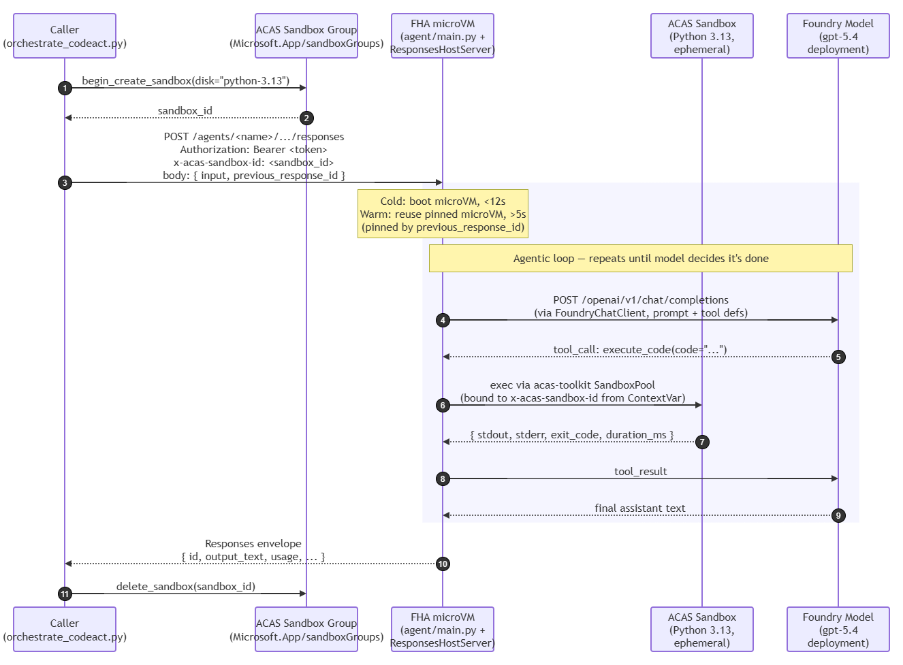

# Architecture

## Sequence Diagram

## Why two dependency stacks?

The repo has **two separate Python environments**:

| Stack | Manifest | Lock | Manager | Runtime |
|---|---|---|---|---|
| Host (orchestrator) | `pyproject.toml` | `uv.lock` | `uv` | Your laptop |
| Container (agent) | `agent/requirements.txt` | `agent/requirements.lock` | `pip` (via Dockerfile) | FHA  |

This separation matters because:

1. **Different surface area.** The orchestrator only needs 4 packages
   (`azure-identity`, `httpx`, `azure-containerapps-sandbox`, `python-dotenv`).
   The container pulls in the full Microsoft Agent Framework with its
   ~188-package transitive closure.
2. **Different lock semantics.** Host stack uses `uv.lock` (TOML, cross-
   platform, resolves at `uv sync` time). Container uses a flat
   `requirements.lock` generated by `uv pip compile` for `linux x86_64 /
   CPython 3.12` so `pip install --no-deps` in the Dockerfile is
   deterministic and fast.
3. **No uv inside the image.** Keeping `uv` out of the runtime image saves
   ~50MB. The lock file has zero remaining resolution work, so plain `pip`
   handles it in a couple of minutes with no risk of `ResolutionTooDeep`.

## What the container does at boot

1. Foundry attaches two ext4 disks: `/dev/vdb` (rootfs, flattened from
   the OCI image) and `/dev/vdc` (mounted at `/home/session`, persists
   between idle→resume cycles within a session).
2. `tini` runs as PID 1; the agent process runs as an orphan reparented to
   it. Standard FHA microVM userland — there is no container runtime.
3. `main.py` constructs a `FoundryChatClient` (auth: managed identity via
   IMDS) and a `_ContextCapturingHostServer` that wraps the standard
   `ResponsesHostServer`. On `:8088` it accepts Responses-protocol POSTs.
4. Each inbound request runs through `_sandbox_id_carrier`, which lifts
   the `x-acas-sandbox-id` header into a `ContextVar`. The tool callbacks
   (`execute_code`, `run_shell`) read that ContextVar to bind to the
   caller-owned sandbox without ever leasing a fresh one.

## Sandbox selection precedence

When the agent dispatches a tool call, `_resolve_sandbox_id()` picks the
target sandbox in this order:

1. **Header** — the per-request `x-acas-sandbox-id`. This is what the
   orchestrator sets, and it's the fast path.
2. **Env var** — `ACAS_SANDBOX_ID`, if present. Useful for deployments
   that share one long-lived sandbox across all invocations.
3. **Fresh lease** — falls back to `SandboxPool.lease()`. This is the
   slow path (~30s on cold lease) and is what runs when neither of the
   above is set.

## Identity model

There are **four** distinct identities to keep straight. The trap most
people fall into is granting the agent's *runtime* roles to the project
MSI and wondering why the agent's tool calls still 403. The project MSI
**does** get one platform-level role (AcrPull, for image pull) but it is
**not** what the agent presents at runtime.

| Identity | Created by | What it does | Bicep grants? |
|---|---|---|---|
| **Caller principal** | You (your `az login`) | Pre-creates the sandbox; calls the agent endpoint. Needs `Container Apps SandboxGroup Data Owner` + `Contributor` on the sandbox group + `Cognitive Services User` + `Azure AI Developer` on the Foundry account + `AcrPush` on the registry. | Yes — [`infra/modules/rbac.bicep`](../infra/modules/rbac.bicep) |
| **Foundry project MI** | The CognitiveServices project sub-resource (`identity.type = SystemAssigned`) | Used by the **Foundry platform** to pull the agent's OCI image from ACR when booting the microVM. Needs `AcrPull` on the registry. The agent's own code never uses this identity — it does **not** resolve from `DefaultAzureCredential` inside the container. Without this grant, `azd up` fails at "Polling agent status" with `[ImageError] Failed to pull container image`. | Yes — [`infra/modules/rbac.bicep`](../infra/modules/rbac.bicep) (`projectAcrPull`) |
| **Agent Blueprint MI** | Foundry, on first registration of a given agent name | Stable per agent name (`FOUNDRY_AGENT_BLUEPRINT_CLIENT_ID` env var inside the microVM). Useful as a Workload Identity Federation trust anchor for downstream RBAC. | No (sample doesn't use WIF) |
| **Agent Instance MI** | Foundry, on first registration of a given agent name | The principal the running container's `DefaultAzureCredential` actually resolves to via IMDS (`FOUNDRY_AGENT_INSTANCE_CLIENT_ID` env var). **This is the one that needs the runtime roles** (sandbox group + Cognitive Services User on Foundry account). Empirically confirmed **stable across version bumps** — versions 1, 6, and 12 of the parent repo's `fha-acas-codeact` agent all share the same `instance_identity.principal_id`. | No — Bicep can't (doesn't exist until first `azd deploy`). Granted by the postdeploy hook [`scripts/grant_agent_roles.sh`](../scripts/grant_agent_roles.sh). |

The postdeploy hook runs after every `azd up` / `azd deploy`. It hits
`GET {project_endpoint}/agents/<name>?api-version=v1`, reads
`.instance_identity.principal_id`, and runs `az role assignment create`
three times against that principal. It's fully idempotent — the Instance
MI is stable across version bumps, so subsequent runs find the same
principal and the role assignments are no-ops. The hook only does
meaningful work on the **first** `azd up` (when the agent name is
registered for the first time and Foundry mints the MI pair).

If either the caller or the Agent Instance MI is missing the
`Container Apps SandboxGroup Data Owner` role, the ACAS SDK silently
retries HTTP 403 ten times before surfacing the error — observed as a
~117 second hang with no log line. This is the failure mode the
postdeploy hook exists to prevent.
